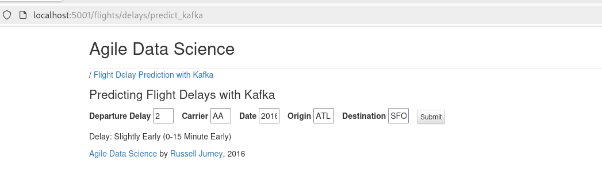

# Guía Predicción de Retrasos en Vuelos

---

## 1: Creación de Imágenes Docker

Para empezar, necesitas construir las imágenes Docker necesarias. Sigue estos pasos para cada una:

### MONGO:
* En la carpeta `dockermongo` hay un **Dockerfile**. Muévelo de `dockermongo` a la raíz de tu carpeta `practica`.
* Una vez que el `Dockerfile` esté en `practica`, ejecuta en la terminal:
    ```bash
    docker build -t mongo-image .
    ```
* Finalmente, devuelve el `Dockerfile` a la carpeta `dockermongo`.

### FLASK:
* En la carpeta `dockerflask` hay un **Dockerfile**. Muévelo de `dockerflask` a la raíz de tu carpeta `practica`.
* Una vez que el `Dockerfile` esté en `practica`, ejecuta en la terminal:
    ```bash
    docker build -t flask-image .
    ```
* Finalmente, devuelve el `Dockerfile` a la carpeta `dockerflask`.

### AIRFLOW:
* En la carpeta `dockerairflow` hay un **Dockerfile**. Muévelo de `dockerairflow` a la raíz de tu carpeta `practica`.
* Una vez que el `Dockerfile` esté en `practica`, ejecuta en la terminal:
    ```bash
    docker build -t airflow-image .
    ```
* Finalmente, devuelve el `Dockerfile` a la carpeta `dockerairflow`.

Tambien puedes utilizar estas imagenes ya creadas.


---

## 2: Creación de Contenedores Docker

Una vez que tus imágenes estén construidas, puedes crear y levantar los contenedores usando `docker compose`.

* Ejecuta en la terminal:
    ```bash
    docker compose up -d
    ```
    Esto creará y arrancará tus contenedores en segundo plano.


* Para verificar que los contenedores se han creado correctamente, ejecuta:
    ```bash
    docker compose ps
    ```
* Si ves tus contenedores listados, la dockerización especificada en la práctica estará completa.

---

## 3: Comprobación de Funcionalidad

Ahora, verifica que todos los componentes estén funcionando correctamente.

### FLASK:
* Accede a la ruta `http://localhost:5001/flights/delays/predict_kafka` y aquí puedes realizar las predicciones con los valores que desees.


### SPARK:
* Accedemos a la ruta `http://localhost:8080` y comprobamos que tenemos dos workers y un master.
* Nos debería aparecer algo similar a esto:


### NIFI:
* Tenemos un flujo en formato **XML** ya definido y guardado en la carpeta `practica`.
* Accede a `http://localhost:8520/nifi/`, importa el flujo y prueba su funcionamiento realizando algunas predicciones.


  
* Para comprobar que las predicciones se guardan correctamente, accede al contenedor de Nifi:
    ```bash
    docker exec -ti nifi bash
    ```
* Busca y muévete a la carpeta `output`. Dentro de esta, deberías encontrar los archivos `.txt`. Para comprobar su contenido, usa `cat <id del txt>`.
* Tambien podemos ver las predicciones en la carpeta nifi_output.
  


### KAFKA:
* Para comprobar que las predicciones se están escribiendo en Kafka, accede al contenedor de Kafka:
    ```bash
    docker exec -ti kafka bash
    ```
* Dentro del contenedor, muévete a la carpeta `bin`.
* Verifica los tópicos creados con:
    ```bash
    kafka-topics.sh --bootstrap-server localhost:9092 --list
    ```
* Para ver que se escriben las predicciones, ejecuta:
    ```bash
    kafka-console-consumer.sh \
      --bootstrap-server localhost:9092 \
      --topic flight-delay-ml-result \
      --from-beginning
    ```
    Verás las predicciones guardadas anteriormente y cualquier nueva predicción que se realice se registrará aquí.


### AIRFLOW:
* Accede a la interfaz de Airflow en `http://localhost:8181`. El usuario y la contraseña son `admin`.
* Una vez dentro de Airflow, pon en ejecución el DAG para entrenar los modelos, el cual se llama **agile_data_science_batch_prediction_model_training**.
* Tanto el DAG como el proceso de `train` se pondrán en estado `running`. Debes esperar a que cambien a estado `success`.


### HDFS:
* Accede a la interfaz de HDFS en `http://localhost:9870`.
* Navega a **Utilities** y busca los ficheros del sistema. Deberías ver un directorio, haz clic en `user`, luego en `spark` y finalmente en `predictions`, donde se guardan las predicciones realizadas.

  
* Si quieres ver estas predicciones desde la terminal, accede al contenedor del datanode con:
    ```bash
    docker exec -it hadoop-namenode bash
    ```
* Para ver las predicciones, ejecuta:
    ```bash
    hdfs dfs -ls /user/spark/predictions
    ```
* Si quieres ver el contenido de una predicción específica, ejecuta:
    ```bash
    hdfs dfs -cat <ruta-prediccion>
    ```
